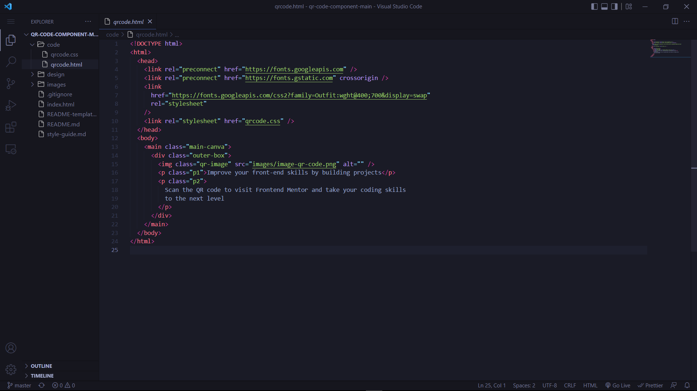
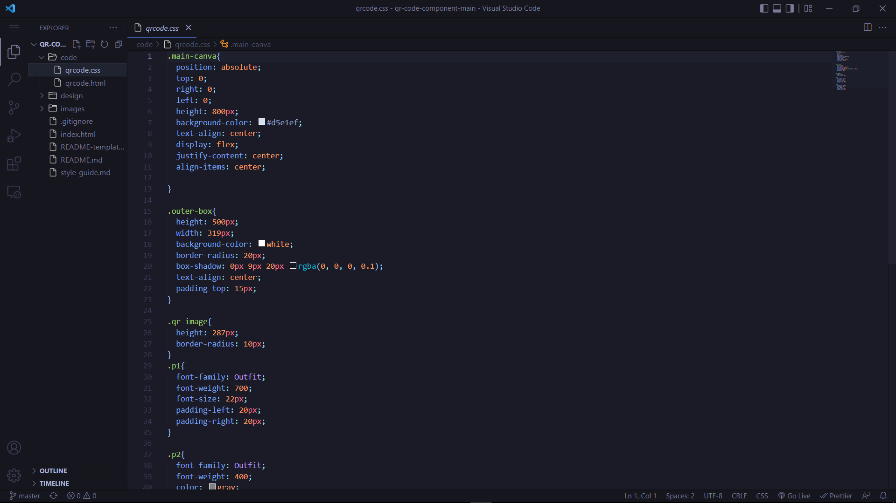

# Frontend Mentor - QR code component solution

This is a solution to the [QR code component challenge on Frontend Mentor](https://www.frontendmentor.io/challenges/qr-code-component-iux_sIO_H). Frontend Mentor challenges help you improve your coding skills by building realistic projects.

## Table of contents

- [Overview](#overview)
  - [Screenshot](#screenshot)
  - [Links](#links)
- [My process](#my-process)
  - [Built with](#built-with)
  - [What I learned](#what-i-learned)
  - [Continued development](#continued-development)
  - [Useful resources](#useful-resources)
- [Author](#author)
- [Acknowledgments](#acknowledgments)

**Note: Delete this note and update the table of contents based on what sections you keep.**

## Overview

### Screenshot

entire section.\*\*

### Links

- Solution URL: [Add solution URL here](https://github.com/vibe-coder/QR-code-component/tree/master/code)
- Live Site URL: [Add live site URL here](https://your-live-site-url.com)

## My process

- I started by going through the resources and planning my solution flow.
- To get the design perfectly, I used Photoshop to determine the color code for the background color and the dimensions of the qr code.
- After fi.ishing up with the design, I had to go learn how to publish my solution to GITHUB so that I cann be able to submit the link to my solution
- After the tutorial, I was able to publish my design and my code.

### Built with

- Semantic HTML5 markup
- CSS custom properties
- Flexbox
- Desktop-first workflow

## Author

- Website - [Vibe-Coder](https://github.com/vibe-coder)
- Frontend Mentor - [@vibe-coder](https://www.frontendmentor.io/profile/TheRealWalker-creator)
- Twitter - [@vibe_coder](https://twitter.com/vibe_coder)

## Acknowledgments

It is great knowing about Frontend Mentor. A friend of mine introduced me to the site and after spending few minutes on the website, I decided to give this a shot. Thank You Frontend Mentor for this wonderful project.
